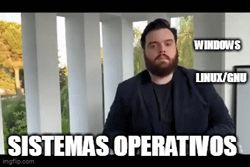

# gluxinos
linux en windows 
se usa cynus 1.0
tlc/tk como perl
y algunos editores como ed vim http://gnuwin32.sourceforge.net/
se utilizan los directorios mas importantes linux http://mural.uv.es/oshuso/823_directorios_ms_importantes_en_linux.html
se pretende crear un linux en windows creando la interfaz grafica con tlc/tk
[](https://www.youtube.com/watch?v=kNHYKyNpIcA)
 # Guía para Compilar y Cargar Programas en Raspberry Pi Pico usando la Línea de Comandos

Este README explica cómo compilar y cargar un programa básico de **Blink** en tu **Raspberry Pi Pico** usando la línea de comandos y los binarios del IDE de Arduino.

---

## 1. Pre-requisitos

Asegúrate de tener los siguientes componentes:

- **Arduino IDE** instalado (con soporte para Raspberry Pi Pico).
- **Compilador `arm-none-eabi-gcc`** instalado (se incluye en el soporte de Arduino para Raspberry Pi Pico).
- **Acceso al puerto USB** donde está conectada la Raspberry Pi Pico.

### Ubicación de los binarios ARM en Arduino IDE:
```txt
C:\Program Files (x86)\Arduino\hardware\tools\arm\bin
2. Crear el Código Blink
Primero, crea un archivo llamado blink.cpp con el siguiente contenido para encender y apagar el LED integrado en la Raspberry Pi Pico:

cpp
Copiar código
#include "pico/stdlib.h"

int main() {
    const uint LED_PIN = 25; // Pin LED integrado en Raspberry Pi Pico
    gpio_init(LED_PIN);
    gpio_set_dir(LED_PIN, GPIO_OUT);

    while (true) {
        gpio_put(LED_PIN, 1); // Enciende el LED
        sleep_ms(500);
        gpio_put(LED_PIN, 0); // Apaga el LED
        sleep_ms(500);
    }
}
